[placeholder]

## Introduction

A query planner is a component of a database management system (DBMS) that is responsible for generating a plan for
executing a database query. The query plan specifies the steps that the DBMS will take to retrieve the data requested by
the query. The goal of the query planner is to generate a plan that is as efficient as possible, meaning that it will
return the data to the user as quickly as possible.

Query planners are complex pieces of software, and they can be difficult to understand. This guide to implementing a
cost-based query planner will provide you with a step-by-step overview of the process, how to implement your own
cost-based query planner, while still cover the basic concepts of query planner.

> Written by AI, edited by human

## Targeted audiences

This guide is written for:

- who used to work with query engines
- who curious, want to make their own stuffs
- who wants to learn DB stuffs but hate math

Goals:

- Able to understand the basic of query planning
- Able to write your own query planner

## Basic architecture of a query engine

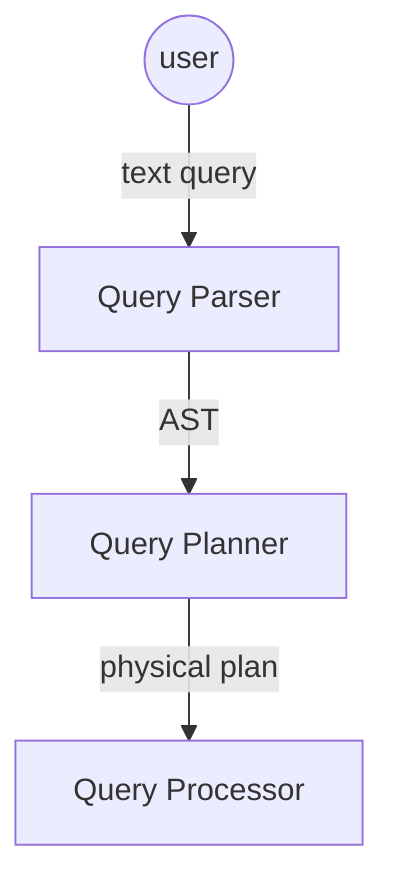

Basic architecture of a query engine is consisted of those components:

- **Query parser:** used to parse user query input, usually in human-readable text format (such as SQL)
- **Query planner:** used to generate the plan/strategy to execute the query. Normally the query planner will choose the
  best plan among several plans generated from a single query
- **Query processor:** used to execute the query plan, which is output by the query planner

## Types of query planners

Normally, query planners are divided into 2 types:

- heuristic planner
- cost-based planner

Heuristic planner is the query planner which used pre-defined rules to generate query plan.

Cost-based planner is the query planner who based on the cost to generate query, it tries to find the optimal plan based
on cost of the input query.

While heuristic planner usually find the best plan by apply transform rules if it knows that the transformed plan is
better, the cost-based planner find the best plan by enumerate equivalent plans and try to find the best plan among
them.

### Cost based query planner

In cost based query planner, it's usually composed of phases:

- Plan Enumerations
- Query Optimization

In the Plan Enumerations phase, the planner will enumerate the possible equivalent plans.

After that, in Query Optimization phase, the planner will search for the best plan from the list of enumerated plans.
The best plan is the plan having the lowest cost, which the cost model (or cost function) is defined.

Because the natural of logical plan, is having tree-like structure, so you can think the optimization/search is actually
a tree-search problem. And there are lots of tree-search algorithms out here:

- Exhaustive search, such as deterministic dynamic programming. The algorithm will perform searching for best plan until
  search termination conditions
- Randomized search, such as randomized tree search. The algorithm will perform searching for best plan until
  search termination conditions

**notes:** in theory it's possible to use any kind of tree-search algorithm. However, in practical it's not feasible
since the
search time is increased when our search algorithm is complex

**notes:** the search termination conditions usually are:

- search exhaustion (when no more plans to visit)
- cost threshold (when found a plan that cost is lower than a specified cost threshold)
- time (when the search phase is running for too long)

### Volcano query planner

Volcano query planner (or Volcano optimizer generator) is a cost-based query planner

Volcano planner uses dynamic programming approach to find the best query plan from the list of enumerated plans.

details: https://ieeexplore.ieee.org/document/344061 (I'm too lazy to explain the paper here)

Here is a great explanation: https://15721.courses.cs.cmu.edu/spring2017/slides/15-optimizer2.pdf#page=9

## Drafting our cost-based query planner

Our query planner, is a cost based query planner, following the basic idea of Volcano query planner
Our planner will be consisted of 2 main phases:

- exploration/search phase
- implementation/optimization phase

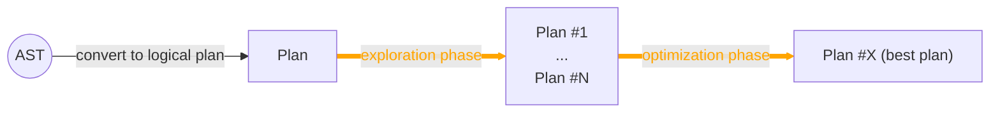

#### Glossary

##### Logical plan

Logical plan is the datastructure holding the abstraction of transformation step required to execute the query.

Here is an example of a logical plan:

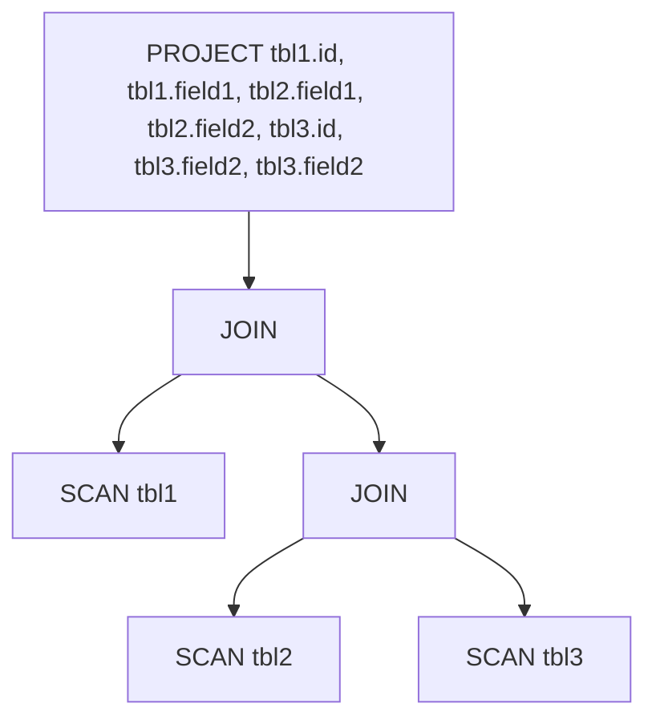

##### Physical plan

While logical plan only holds the abstraction, physical plan is the datastructure holding the implementation details.
Each logical plan will have multiple physical plans. For example, a logical JOIN might has many physical plans such as
HASH JOIN, MERGE JOIN, BROADCAST JOIN, etc.

##### Equivalent Group

Equivalent group is a group of equivalent expressions (which for each expression, their logical plan is logically
equivalent)

e.g.

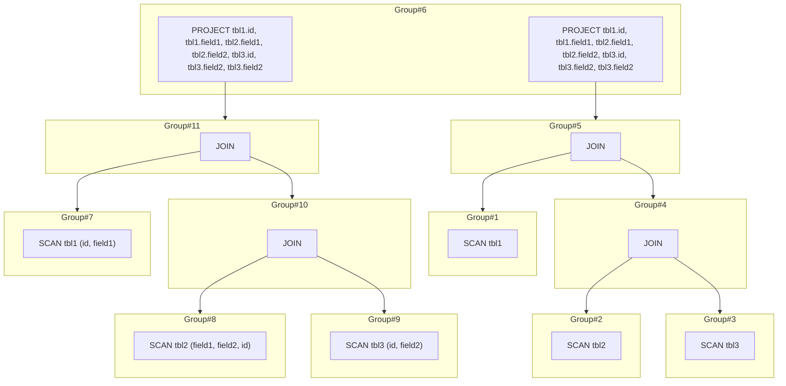

Here we can see `Group#6` is having 2 equivalent expressions, which are both representing the same query (one is doing
scan from table then project, one is pushing down the projection down to SCAN node).

##### Transformation rule

Transformation rule is the rule to transform from one logical plan to another logical equivalent logical plan

For example, the plan:


when apply the projection pushdown transformation, is transformed to:

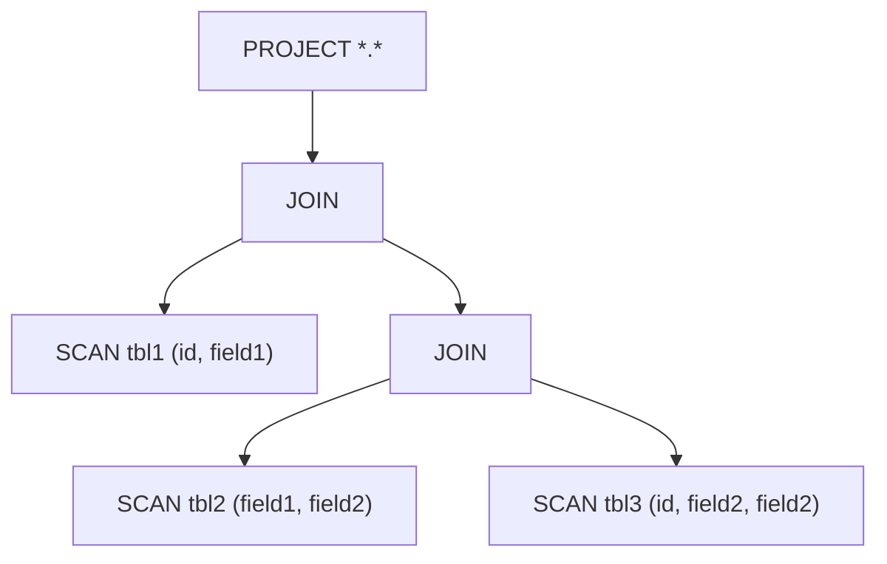

The transformation rule can be affect by logical traits/properties such as table schema, data statistics, etc.

##### Implementation rule

Implementation rule is the rule to return the physical plans given logical plan.

The implementation rule can be affect by physical traits/properties such as data layout (sorted or not), etc.

#### Exploration phase

In the exploration phase, the planner will apply transformation rules, generating equivalent logical plans

For example, the plan:

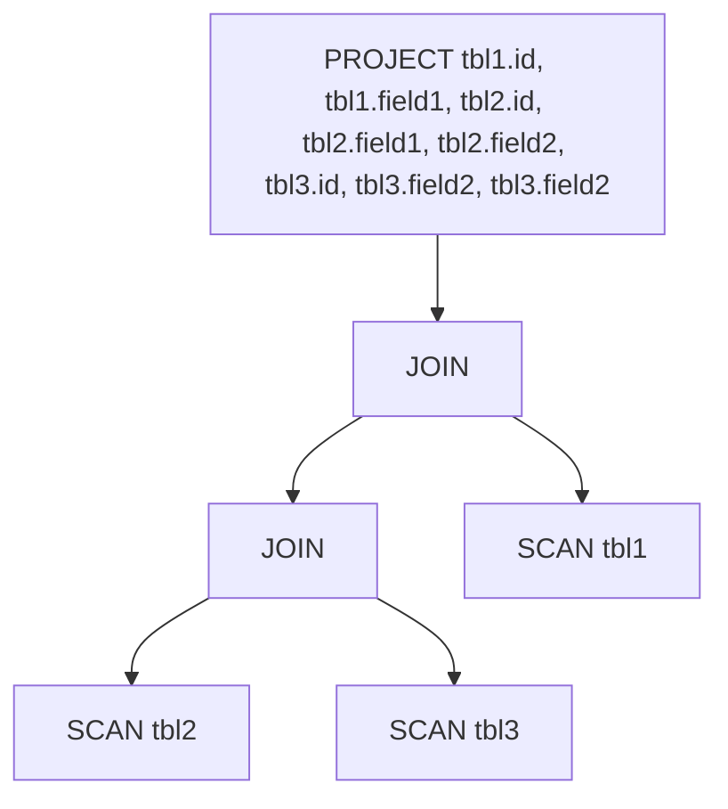

After applying transformation rules, resulting in the following graph:

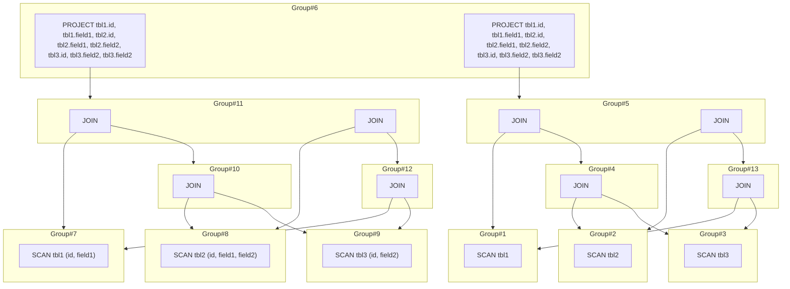

Here we can see that projection pushdown rule and join reorder rule are applied.

#### Optimization phase

The optimization phase, is to traverse the expanded tree in exploration phase, to find the best
plan for our query.

This "actually" is tree search optimization, so you can use any tree search algorithm you can imagine (but you have to
make sure it's correct).

Here is the example of generated physical plan after optimization phase:

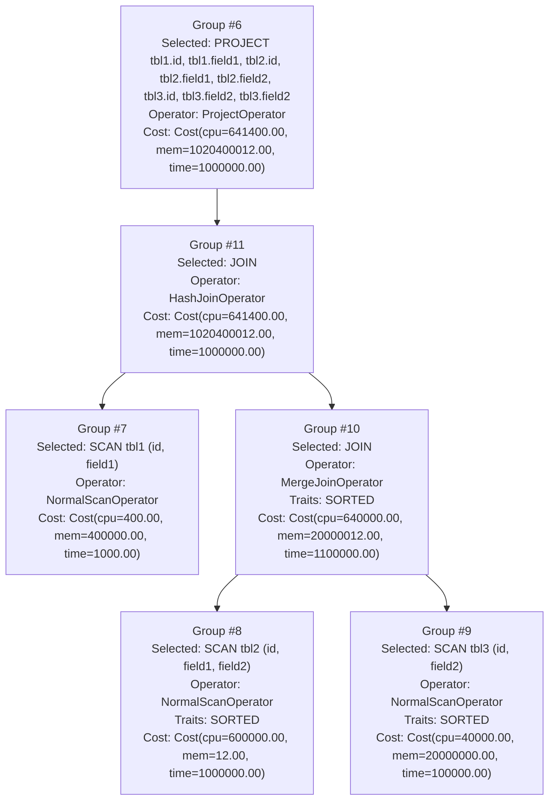

The generated plan has shown the selected logical plan, the estimated cost, and the physical operator

#### Optimize/search termination

Our planner will perform exhaustion search to find the best plan

## Diving into the codes

Since the code of the planner is big, so I will not write step-by-step guide, but I will explain every piece of the code
instead

### The query language

Here we will define a query language which used thoroughly this tutorial

```sql
SELECT emp.id,
       emp.code,
       dept.dept_name,
       emp_info.name,
       emp_info.origin
FROM emp
         JOIN dept ON emp.id = dept.emp_id
         JOIN emp_info ON dept.emp_id = emp_info.id
```

The query language we will implement is a SQL-like language.
However, for the sake of simplicity, we will restrict its functionality and syntax.

The language is appeared in form of

```sql
SELECT tbl.field, [...]
FROM tbl JOIN [...]
```

It will only support for `SELECT` and `JOIN`, also the field in Select statement must be fully qualified (in form
of `table.field`), all other functionalities will not be supported

#### The AST

First, we have to define the AST for our language. AST (
or [Abstract Syntax Tree](https://en.wikipedia.org/wiki/Abstract_syntax_tree)) is a tree used to represent the syntactic
structure of a text.

Since our language is so simple, we just can define the AST structure in several line of codes:

```scala
sealed trait Identifier

case class TableID(id: String) extends Identifier

case class FieldID(table: TableID, id: String) extends Identifier

sealed trait Statement

case class Table(table: TableID) extends Statement

case class Join(left: Statement, right: Statement, on: Seq[(FieldID, FieldID)]) extends Statement

case class Select(fields: Seq[FieldID], from: Statement) extends Statement

```

For example, a query

```sql
SELECT tbl1.id,
       tbl1.field1,
       tbl2.id,
       tbl2.field1,
       tbl2.field2,
       tbl3.id,
       tbl3.field2,
       tbl3.field2
FROM tbl1
         JOIN tbl2 ON tbl1.id = tbl2.id
         JOIN tbl3 ON tbl2.id = tbl3.id
```

can be represented as

```scala
Select(
  Seq(
    FieldID(TableID("tbl1"), "id"),
    FieldID(TableID("tbl1"), "field1"),
    FieldID(TableID("tbl2"), "id"),
    FieldID(TableID("tbl2"), "field1"),
    FieldID(TableID("tbl2"), "field2"),
    FieldID(TableID("tbl3"), "id"),
    FieldID(TableID("tbl3"), "field2"),
    FieldID(TableID("tbl3"), "field2")
  ),
  Join(
    Table(TableID("tbl1")),
    Join(
      Table(TableID("tbl2")),
      Table(TableID("tbl3")),
      Seq(
        FieldID(TableID("tbl2"), "id") -> FieldID(TableID("tbl3"), "id")
      )
    ),
    Seq(
      FieldID(TableID("tbl1"), "id") -> FieldID(TableID("tbl2"), "id")
    )
  )
)
```

#### A simple query parser

After defined the AST structure, we will have to write the query parser, which is used to convert the text query into
AST form.

Since this guide is using Scala for implementation, we will
choose [scala-parser-combinators](https://github.com/scala/scala-parser-combinators) to create our query parser.

Query parser class:

```scala
object QueryParser extends ParserWithCtx[QueryExecutionContext, Statement] with RegexParsers {

  override def parse(in: String)(implicit ctx: QueryExecutionContext): Either[Throwable, Statement] = {
    Try(parseAll(statement, in) match {
      case Success(result, _) => Right(result)
      case NoSuccess(msg, _) => Left(new Exception(msg))
    }) match {
      case util.Failure(ex) => Left(ex)
      case util.Success(value) => value
    }
  }

  private def select: Parser[Select] = ??? // we will implement it in later section

  private def statement: Parser[Statement] = select
}

```

Then define some parse rules:

```scala
// common
private def str: Parser[String] = """[a-zA-Z0-9_]+""".r
private def fqdnStr: Parser[String] = """[a-zA-Z0-9_]+\.[a-zA-Z0-9_]+""".r

// identifier
private def tableId: Parser[TableID] = str ^^ (s => TableID(s))

private def fieldId: Parser[FieldID] = fqdnStr ^^ { s =>
  val identifiers = s.split('.')
  if (identifiers.length != 2) {
    throw new Exception("should never happen")
  } else {
    val table = identifiers.head
    val field = identifiers(1)
    FieldID(TableID(table), field)
  }
}
```

Here are two rules, which are used to parse the identifiers: `TableID` and `FieldID`.

Table ID (or table name) usually only contains characters, numbers and underscores (`_`), so we will use a simple
regex `[a-zA-Z0-9_]+` to identify the table name.

On the other hand, Field ID (for field qualifier) in our language is fully-qualified-field-name. Normally it's in form
of `table.field`, and field name also usually only contains characters, numbers and underscores, so we will use the
regex `[a-zA-Z0-9_]+\.[a-zA-Z0-9_]+` to parser the field name.

After defining the rules for parsing the identifiers, we can now define rules to parse query statement:

```scala
// statement
private def table: Parser[Table] = tableId ^^ (t => Table(t))
private def subQuery: Parser[Statement] = "(" ~> select <~ ")"
```

The `table` rule is a simple rule, it just creates `Table` node by using the parsed `TableID` from `tableId` rule.

The `subQuery`, is the rule to parse the sub-query. In SQL, we can write a query which is looked like this:

```sql
SELECT a
FROM (SELECT b FROM c) d
```

The `SELECT b FROM c` is the sub-query in above statement. Here, in our simple query language, we will indicate a
statement is a sub-query if it is enclosed by a pair of parentheses (`()`). Since our language only have SELECT
statement, we can write the parse rule as following:

```scala
def subQuery: Parser[Statement] = "(" ~> select <~ ")"
```

Now we will define the parse rules for SELECT statement:

```scala
private def fromSource: Parser[Statement] = table ||| subQuery

private def select: Parser[Select] =
  "SELECT" ~ rep1sep(fieldId, ",") ~ "FROM" ~ fromSource ~ rep(
    "JOIN" ~ fromSource ~ "ON" ~ rep1(fieldId ~ "=" ~ fieldId)
  ) ^^ {
    case _ ~ fields ~ _ ~ src ~ joins =>
      val p = if (joins.nonEmpty) {
        def chain(left: Statement, right: Seq[(Statement, Seq[(FieldID, FieldID)])]): Join = {
          if (right.isEmpty) {
            throw new Exception("should never happen")
          } else if (right.length == 1) {
            val next = right.head
            Join(left, next._1, next._2)
          } else {
            val next = right.head
            Join(left, chain(next._1, right.tail), next._2)
          }
        }

        val temp = joins.map { join =>
          val statement = join._1._1._2
          val joinOn = join._2.map(on => on._1._1 -> on._2)
          statement -> joinOn
        }
        chain(src, temp)
      } else {
        src
      }
      Select(fields, p)
  }
```

In SQL, we can use a sub-query as a JOIN source. For example:

```sql
SELECT *.*
FROM tbl1
    JOIN (SELECT *.* FROM tbl2)
    JOIN tbl3
```

So our parser will also implement rules to parse the sub-query in the JOIN part of the statement, that's why we have the
parse rule:

```scala
"SELECT" ~ rep1sep(fieldId, ",") ~ "FROM" ~ fromSource ~ rep("JOIN" ~ fromSource ~ "ON" ~ rep1(fieldId ~ "=" ~ fieldId)
```

See [QueryParser.scala](core%2Fsrc%2Fmain%2Fscala%2Fcore%2Fql%2FQueryParser.scala) for full implementation

#### Testing our query parser

See [QueryParserSpec.scala](core%2Fsrc%2Ftest%2Fscala%2Fcore%2Fql%2FQueryParserSpec.scala)

### Logical plan

After generate the AST from the text query, we can directly convert it to the logical plan

First, lets define the interface for our logical plan:

```scala
sealed trait LogicalPlan {
  def children(): Seq[LogicalPlan]
}

```

`children` is the list of child logical plan. For example:


The child nodes of the `PROJECT` node is the first `JOIN` node. The first `JOIN` node has 2 children, which are the
second `JOIN` node and `SCAN tbl1` node. So on, ...

Since our query language is simple, we only need 3 types of logical node:

- PROJECT: represent the projection operator in relation algebra
- JOIN: represent the logical join
- SCAN: represent the table scan

```scala
case class Scan(table: ql.TableID, projection: Seq[String]) extends LogicalPlan {
  override def children(): Seq[LogicalPlan] = Seq.empty
}

case class Project(fields: Seq[ql.FieldID], child: LogicalPlan) extends LogicalPlan {
  override def children(): Seq[LogicalPlan] = Seq(child)
}

case class Join(left: LogicalPlan, right: LogicalPlan, on: Seq[(ql.FieldID, ql.FieldID)]) extends LogicalPlan {
  override def children(): Seq[LogicalPlan] = Seq(left, right)
}

```

Then we can write the function to convert the AST into logical plan:

```scala
def toPlan(node: ql.Statement): LogicalPlan = {
  node match {
    case ql.Table(table) => Scan(table, Seq.empty)
    case ql.Join(left, right, on) => Join(toPlan(left), toPlan(right), on)
    case ql.Select(fields, from) => Project(fields, toPlan(from))
  }
}
```

See [LogicalPlan.scala](core%2Fsrc%2Fmain%2Fscala%2Fcore%2Fplanner%2Fvolcano%2Flogicalplan%2FLogicalPlan.scala) for full
implementation

### The equivalent groups

#### Group

We can define classes for Group as following:

```scala
case class Group(
                  id: Long,
                  equivalents: mutable.HashSet[GroupExpression]
                ) {
  val explorationMark: ExplorationMark = new ExplorationMark
  var implementation: Option[GroupImplementation] = None
}

case class GroupExpression(
                            id: Long,
                            plan: LogicalPlan,
                            children: mutable.MutableList[Group]
                          ) {
  val explorationMark: ExplorationMark = new ExplorationMark
  val appliedTransformations: mutable.HashSet[TransformationRule] = mutable.HashSet()
}

```

`Group` is the set of plans which are logically equivalent.

Each `GroupExpression` represents a logical plan node. Since we've defined a logical plan node will have a list of child
nodes (in the previous section), and the `GroupExpression` represents a logical plan node, and the `Group` represents a
set of equivalent plans, so the children of `GroupExpression` is a list of `Group`

e.g.

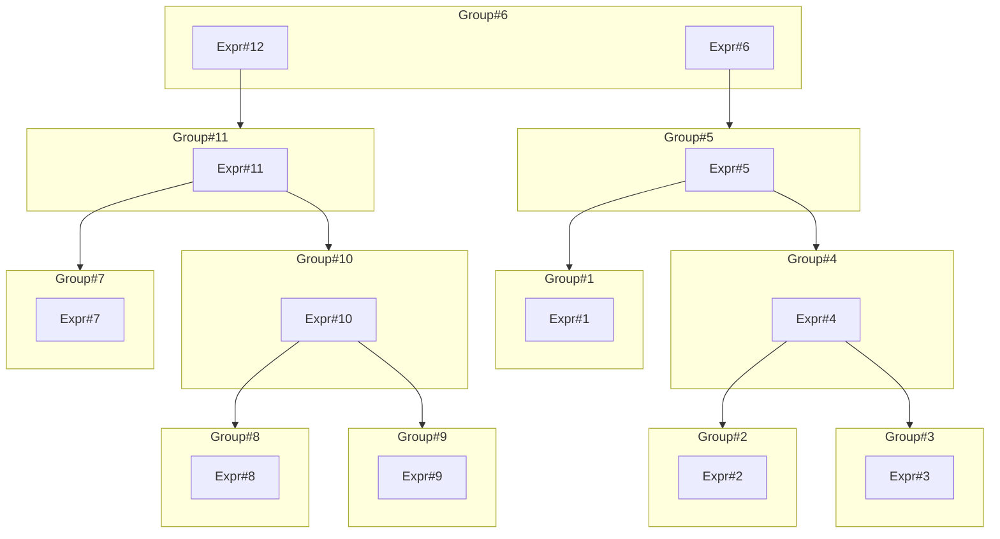

As we can see here, the `Group#6` has 2 equivalent expressions: `Expr#12` and `Expr#6`, and the children of `Expr#12`
is `Group#11`

**notes:** We will implement multiple round transformation in the exploration phase, so for each `Group`
and `GroupExpression`, we have
a `ExplorationMark` indication the exploration status.

```scala
class ExplorationMark {
  private var bits: Long = 0

  def get: Long = bits

  def isExplored(round: Int): Boolean = BitUtils.getBit(bits, round)

  def markExplored(round: Int): Unit = bits = BitUtils.setBit(bits, round, on = true)

  def markUnexplored(round: Int): Unit = bits = BitUtils.setBit(bits, round, on = false)
}

```

`ExplorationMark` is just a bitset wrapper class, it will mark i-th bit as 1 if i-th round is explored, mark as 0
otherwise.

`ExplorationMark` can also be used to visualize the exact transformation,
see [visualization](core%2Fsrc%2Fmain%2Fscala%2Fcore%2Futils%2Fvisualization) for more details

#### Memo

Memo is a bunch of helpers to help constructing the equivalent groups. Memo is consists of several hashmap to cache the
group and group expression, also provide methods to register new group or group expression.

```scala
class Memo(
            groupIdGenerator: Generator[Long] = new LongGenerator,
            groupExpressionIdGenerator: Generator[Long] = new LongGenerator
          ) {
  val groups: mutable.HashMap[Long, Group] = mutable.HashMap[Long, Group]()
  val parents: mutable.HashMap[Long, Group] = mutable.HashMap[Long, Group]() // lookup group from group expression ID
  val groupExpressions: mutable.HashMap[LogicalPlan, GroupExpression] = mutable.HashMap[LogicalPlan, GroupExpression]()

  def getOrCreateGroupExpression(plan: LogicalPlan): GroupExpression = {
    val children = plan.children()
    val childGroups = children.map(child => getOrCreateGroup(child))
    groupExpressions.get(plan) match {
      case Some(found) => found
      case None =>
        val id = groupExpressionIdGenerator.generate()
        val children = mutable.MutableList() ++ childGroups
        val expression = GroupExpression(
          id = id,
          plan = plan,
          children = children
        )
        groupExpressions += plan -> expression
        expression
    }
  }

  def getOrCreateGroup(plan: LogicalPlan): Group = {
    val exprGroup = getOrCreateGroupExpression(plan)
    val group = parents.get(exprGroup.id) match {
      case Some(group) =>
        group.equivalents += exprGroup
        group
      case None =>
        val id = groupIdGenerator.generate()
        val equivalents = mutable.HashSet() + exprGroup
        val group = Group(
          id = id,
          equivalents = equivalents
        )
        groups.put(id, group)
        group
    }
    parents += exprGroup.id -> group
    group
  }
}

```

See [Memo.scala](core%2Fsrc%2Fmain%2Fscala%2Fcore%2Fplanner%2Fvolcano%2Fmemo%2FMemo.scala) for full implementation

### Initialization

The first step inside the planner, is initialization

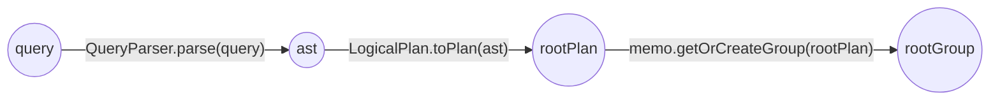

First, query will be parsed into AST. Then converted to logical plan, called `root plan`, then initialize the group
from `root plan`, called `root group`.

```scala
def initialize(query: Statement)(implicit ctx: VolcanoPlannerContext): Unit = {
  ctx.query = query
  ctx.rootPlan = LogicalPlan.toPlan(ctx.query)
  ctx.rootGroup = ctx.memo.getOrCreateGroup(ctx.rootPlan)
  // assuming this is first the exploration round,
  // by marking the initialRound(0) as explored,
  // it will be easier to visualize the different between rounds (added nodes, add connections)
  ctx.memo.groups.values.foreach(_.explorationMark.markExplored(initialRound))
  ctx.memo.groupExpressions.values.foreach(_.explorationMark.markExplored(initialRound))
}
```

See [VolcanoPlanner.scala](core%2Fsrc%2Fmain%2Fscala%2Fcore%2Fplanner%2Fvolcano%2FVolcanoPlanner.scala) for more details

For example, the query:

```sql
SELECT tbl1.id,
       tbl1.field1,
       tbl2.id,
       tbl2.field1,
       tbl2.field2,
       tbl3.id,
       tbl3.field2,
       tbl3.field2
FROM tbl1
         JOIN tbl2 ON tbl1.id = tbl2.id
         JOIN tbl3 ON tbl2.id = tbl3.id
```

after initialization, the groups will be looked like this:

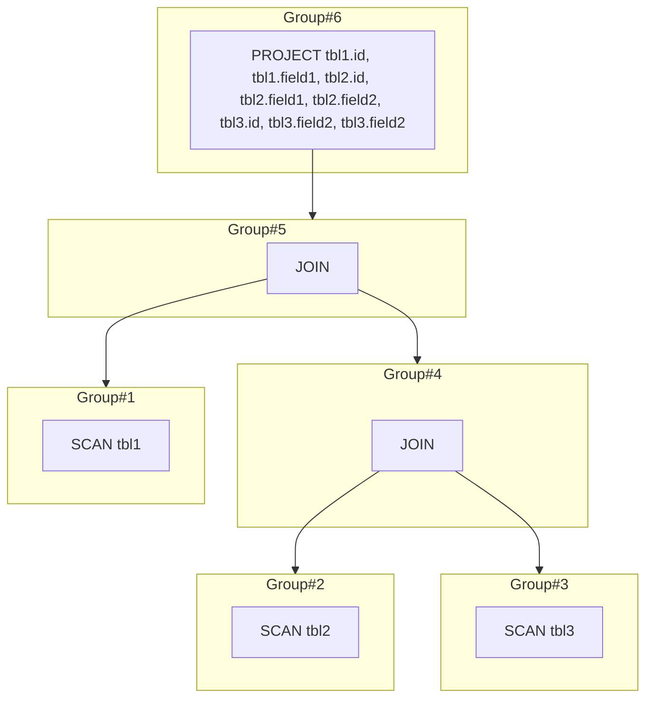

Here you can see that, every group has exactly one equivalent expression

### Exploration phase

After initialization, now is the exploration phase, which will explore all possible equivalent plans.

The exploration method is quite simple:

- For each group, apply transformation rules to find all equivalent group expression and add to equivalent set until we
  couldn't find any new equivalent plan
- For each group expression, explore all child groups

#### Transformation rule

Before diving into exploration code, lets talk about transformation rule first.

Transformation rule is a rule used to transform a logical plan to another equivalent logical plan if it's matched the
rule condition.

Here is the interface of transformation rule:

```scala
trait TransformationRule {
  def `match`(expression: GroupExpression)(implicit ctx: VolcanoPlannerContext): Boolean

  def transform(expression: GroupExpression)(implicit ctx: VolcanoPlannerContext): GroupExpression
}

```

Since the logical plan is a tree-like datastructure, so the `match` implementation of transformation rules is pattern
matching on tree.

For example, here is the `match` that is used to match the PROJECT node while also check if it's descendants containing
JOIN and SCAN only:

```scala
override def `match`(expression: GroupExpression)(implicit ctx: VolcanoPlannerContext): Boolean = {
  val plan = expression.plan
  plan match {
    case Project(_, child) => check(child)
    case _ => false
  }
}

// check if the tree only contains SCAN and JOIN nodes
private def check(node: LogicalPlan): Boolean = {
  node match {
    case Scan(_, _) => true
    case Join(left, right, _) => check(left) && check(right)
    case _ => false
  }
}
```

This plan is "matched":

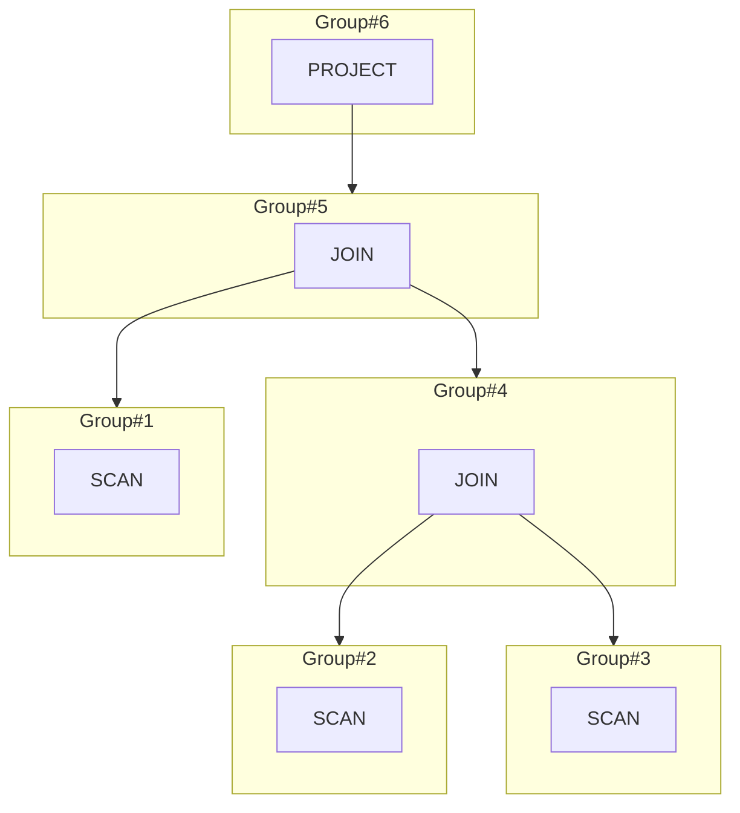

While this plan is not:

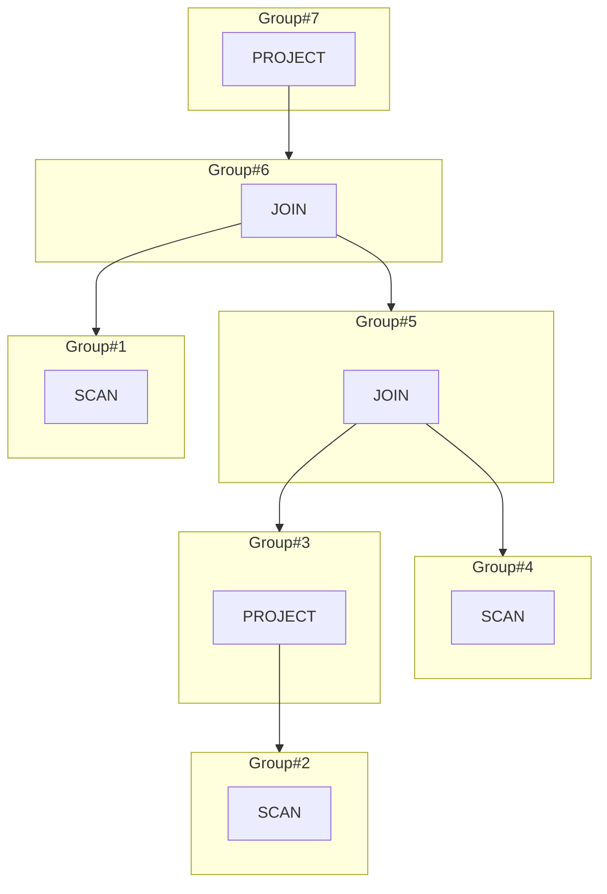

#### Plan enumerations

As we've said before, the exploration method is:

- For each group, apply transformation rules to find all equivalent group expression and add to equivalent set until we
  couldn't find any new equivalent plan
- For each group expression, explore all child groups

And here is exploration code (quite simple, huh):

```scala
private def exploreGroup(
                          group: Group,
                          rules: Seq[TransformationRule],
                          round: Int
                        )(implicit ctx: VolcanoPlannerContext): Unit = {
  while (!group.explorationMark.isExplored(round)) {
    group.explorationMark.markExplored(round)
    // explore all child groups
    group.equivalents.foreach { equivalent =>
      if (!equivalent.explorationMark.isExplored(round)) {
        equivalent.explorationMark.markExplored(round)
        equivalent.children.foreach { child =>
          exploreGroup(child, rules, round)
          if (equivalent.explorationMark.isExplored(round) && child.explorationMark.isExplored(round)) {
            equivalent.explorationMark.markExplored(round)
          } else {
            equivalent.explorationMark.markUnexplored(round)
          }
        }
      }
      // fire transformation rules to explore all the possible transformations
      rules.foreach { rule =>
        if (!equivalent.appliedTransformations.contains(rule) && rule.`match`(equivalent)) {
          val transformed = rule.transform(equivalent)
          if (!group.equivalents.contains(transformed)) {
            group.equivalents += transformed
            transformed.explorationMark.markUnexplored(round)
            group.explorationMark.markUnexplored(round)
          }
        }
      }
      if (group.explorationMark.isExplored(round) && equivalent.explorationMark.isExplored(round)) {
        group.explorationMark.markExplored(round)
      } else {
        group.explorationMark.markUnexplored(round)
      }
    }
  }
}
```

See [VolcanoPlanner.scala](core%2Fsrc%2Fmain%2Fscala%2Fcore%2Fplanner%2Fvolcano%2FVolcanoPlanner.scala) for more details

#### Implement some transformation rules

Now it's time to implement some transformation rules

##### Projection pushdown

Projection pushdown is a simple transformation rule, used to push the projection down to storage layer.

For example, the query

```sql
SELECT field1, field2
from tbl
```

has the plan

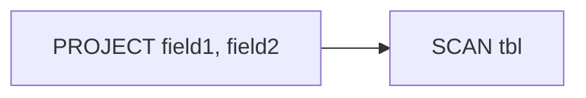

With this plan, when executing, rows from storage layer (under SCAN) will be fully fetched, and then unnecessary fields
will be dropped (PROJECT). The unnecessary data is still have to move from SCAN node to PROJECT node, so there are some
wasted efforts here.

We can make it better by just simply tell the storage layer only fetch the necessary fields. Now the plan will be
transformed to:

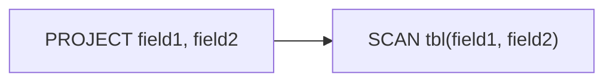

Let's go into the code:

```scala
override def `match`(expression: GroupExpression)(implicit ctx: VolcanoPlannerContext): Boolean = {
  val plan = expression.plan
  plan match {
    case Project(_, child) => check(child)
    case _ => false
  }
}

// check if the tree only contains SCAN and JOIN nodes
private def check(node: LogicalPlan): Boolean = {
  node match {
    case Scan(_, _) => true
    case Join(left, right, _) => check(left) && check(right)
    case _ => false
  }
}
```

Our projection pushdown rule here, will match the plan when it's the PROJECT node, and all of its descendants are SCAN
and JOIN node only.

**notes:** Actually the real projection pushdown match is more complex, but for the sake of simplicity, the match rule
here is just PROJECT node with SCAN and JOIN descendants

And here is the transform code:

```scala
override def transform(expression: GroupExpression)(implicit ctx: VolcanoPlannerContext): GroupExpression = {
  val plan = expression.plan.asInstanceOf[Project]
  val pushDownProjection = mutable.ListBuffer[FieldID]()
  extractProjections(plan, pushDownProjection)
  val newPlan = Project(plan.fields, pushDown(pushDownProjection.distinct, plan.child))
  ctx.memo.getOrCreateGroupExpression(newPlan)
}

private def extractProjections(node: LogicalPlan, buffer: mutable.ListBuffer[FieldID]): Unit = {
  node match {
    case Scan(_, _) => (): Unit
    case Project(fields, parent) =>
      buffer ++= fields
      extractProjections(parent, buffer)
    case Join(left, right, on) =>
      buffer ++= on.map(_._1) ++ on.map(_._2)
      extractProjections(left, buffer)
      extractProjections(right, buffer)
  }
}

private def pushDown(pushDownProjection: Seq[FieldID], node: LogicalPlan): LogicalPlan = {
  node match {
    case Scan(table, tableProjection) =>
      val filteredPushDownProjection = pushDownProjection.filter(_.table == table).map(_.id)
      val updatedProjection =
        if (filteredPushDownProjection.contains("*") || filteredPushDownProjection.contains("*.*")) {
          Seq.empty
        } else {
          (tableProjection ++ filteredPushDownProjection).distinct
        }
      Scan(table, updatedProjection)
    case Join(left, right, on) => Join(pushDown(pushDownProjection, left), pushDown(pushDownProjection, right), on)
    case _ => throw new Exception("should never happen")
  }
}
```

The transform code will first find all projections from the root PROJECT node, and then push them down to all SCAN nodes
under it.

Visualizing our rule, for example, the plan


after applying projection pushdown transformation, will result in a new equivalent plan with the projections are pushed
down to the SCAN operations (the new plan is the tree with orange border nodes).

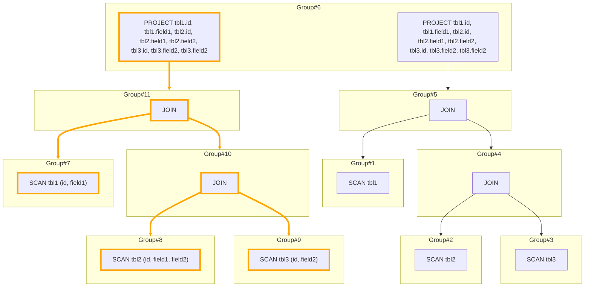

See [ProjectionPushDown.scala](core%2Fsrc%2Fmain%2Fscala%2Fcore%2Fplanner%2Fvolcano%2Frules%2Ftransform%2FProjectionPushDown.scala)
for full implementation

##### Join reorder

Join reorder is also one of the most recognized transformation in the world of query planner. Our planner, will also
implement a reorder transformation rule.

Since Join reorder in real world is not an easy piece to implement. So we will implement a simple, rip-off version of
join reorder rule here.

First, the rule `match`:

```scala
// check if the tree only contains SCAN and JOIN nodes, and also extract all SCAN nodes and JOIN conditions
private def checkAndExtract(
                             node: LogicalPlan,
                             buffer: mutable.ListBuffer[Scan],
                             joinCondBuffer: mutable.ListBuffer[(ql.FieldID, ql.FieldID)]
                           ): Boolean = {
  node match {
    case node@Scan(_, _) =>
      buffer += node
      true
    case Join(left, right, on) =>
      joinCondBuffer ++= on
      checkAndExtract(left, buffer, joinCondBuffer) && checkAndExtract(right, buffer, joinCondBuffer)
    case _ => false
  }
}

private def buildInterchangeableJoinCond(conditions: Seq[(ql.FieldID, ql.FieldID)]): Seq[Seq[ql.FieldID]] = {
  val buffer = mutable.ListBuffer[mutable.Set[ql.FieldID]]()
  conditions.foreach { cond =>
    val set = buffer.find { set =>
      set.contains(cond._1) || set.contains(cond._2)
    } match {
      case Some(set) => set
      case None =>
        val set = mutable.Set[ql.FieldID]()
        buffer += set
        set
    }
    set += cond._1
    set += cond._2
  }
  buffer.map(_.toSeq)
}

override def `match`(expression: GroupExpression)(implicit ctx: VolcanoPlannerContext): Boolean = {
  val plan = expression.plan
  plan match {
    case node@Join(_, _, _) =>
      val buffer = mutable.ListBuffer[Scan]()
      val joinCondBuffer = mutable.ListBuffer[(ql.FieldID, ql.FieldID)]()
      if (checkAndExtract(node, buffer, joinCondBuffer)) {
        // only match if the join is 3 tables join
        if (buffer.size == 3) {
          var check = true
          val interChangeableCond = buildInterchangeableJoinCond(joinCondBuffer)
          interChangeableCond.foreach { c =>
            check &= c.size == 3
          }
          check
        } else {
          false
        }
      } else {
        false
      }
    case _ => false
  }
}
```

Our rule will only be matched, if we match the 3-way JOIN (the number of involved table must be 3, and the join
condition must be 3-way, such as `tbl1.field1 = tbl2.field2 = tbl3.field3`)

For example,

```sql
tbl1
    JOIN tbl2 ON tbl1.field1 = tbl2.field2
    JOIN tbl3 ON tbl1.field1 = tbl3.field3
```

The join statement here will be "matched" since it's 3-way JOIN (it's the join between `tbl1`, `tbl2`, `tbl3`, and the
condition is `tbl1.field1 = tbl2.field2 = tbl3.field3`)

Next, is the transform code:

```scala
override def transform(expression: GroupExpression)(implicit ctx: VolcanoPlannerContext): GroupExpression = {
  val plan = expression.plan.asInstanceOf[Join]
  val buffer = mutable.ListBuffer[Scan]()
  val joinCondBuffer = mutable.ListBuffer[(ql.FieldID, ql.FieldID)]()
  checkAndExtract(plan, buffer, joinCondBuffer)
  val interChangeableCond = buildInterchangeableJoinCond(joinCondBuffer)
  //
  val scans = buffer.toList
  implicit val ord: Ordering[Scan] = new Ordering[Scan] {
    override def compare(x: Scan, y: Scan): Int = {
      val xStats = ctx.statsProvider.tableStats(x.table.id)
      val yStats = ctx.statsProvider.tableStats(y.table.id)
      xStats.estimatedTableSize.compareTo(yStats.estimatedTableSize)
    }
  }

  def getJoinCond(left: Scan, right: Scan): Seq[(ql.FieldID, ql.FieldID)] = {
    val leftFields = interChangeableCond.flatMap { c =>
      c.filter(p => p.table == left.table)
    }
    val rightFields = interChangeableCond.flatMap { c =>
      c.filter(p => p.table == right.table)
    }
    if (leftFields.length != rightFields.length) {
      throw new Exception(s"leftFields.length(${leftFields.length}) != rightFields.length(${rightFields.length})")
    } else {
      leftFields zip rightFields
    }
  }

  val sorted = scans.sorted
  val newPlan = Join(
    sorted(0),
    Join(
      sorted(1),
      sorted(2),
      getJoinCond(sorted(1), sorted(2))
    ),
    getJoinCond(sorted(0), sorted(1))
  )
  ctx.memo.getOrCreateGroupExpression(newPlan)
}
```

The transform code here, will reorder the tables by its estimated size.

For example, if we have 3 tables A, B, C with estimated size of 300b, 100b, 200b and a JOIN statement `A JOIN B JOIN C`,
then it will be transformed into `B JOIN C JOIN A`

**notes:** You might notice in this code, we've made use of table statistics, to provide a hint to transform the plan.
In practical, the planner can use all sorts of statistics to aid its transformation such as table size, row size, null
count, histogram, etc.

Visualizing our rule, for example, the plan


after join reorder transformation, resulting in

```mermaid
graph TD
    subgraph Group#2
        Expr#2["SCAN tbl2"]
    end
    subgraph Group#5
        Expr#5["JOIN"]
        Expr#8["JOIN"]
    end
    Expr#5 --> Group#1
    Expr#5 --> Group#4
    Expr#8 --> Group#2
    Expr#8 --> Group#7
    subgraph Group#4
        Expr#4["JOIN"]
    end
    Expr#4 --> Group#2
    Expr#4 --> Group#3
    subgraph Group#7
        Expr#7["JOIN"]
    end
    Expr#7 --> Group#1
    Expr#7 --> Group#3
    subgraph Group#1
        Expr#1["SCAN tbl1"]
    end
    subgraph Group#3
        Expr#3["SCAN tbl3"]
    end
    subgraph Group#6
        Expr#6["PROJECT tbl1.id, tbl1.field1, tbl2.id, tbl2.field1, tbl2.field2, tbl3.id, tbl3.field2, tbl3.field2"]
    end
    Expr#6 --> Group#5
    style Expr#8 stroke-width: 4px, stroke: orange
    style Expr#7 stroke-width: 4px, stroke: orange
    linkStyle 2 stroke-width: 4px, stroke: orange
    linkStyle 6 stroke-width: 4px, stroke: orange
    linkStyle 3 stroke-width: 4px, stroke: orange
    linkStyle 7 stroke-width: 4px, stroke: orange
```

we can see that `tbl2 JOIN tbl1 JOIN tbl3` is created from `tbl1 JOIN tbl2 JOIN tbl3` is generated by the
transformation (the newly added nodes and edges are indicated by orange lines)

See [X3TableJoinReorderBySize.scala](core%2Fsrc%2Fmain%2Fscala%2Fcore%2Fplanner%2Fvolcano%2Frules%2Ftransform%2FX3TableJoinReorderBySize.scala)
for full implementation

##### Putting all transformations together

Now we can put our transformation rules in one place

```scala
private val transformationRules: Seq[Seq[TransformationRule]] = Seq(
  Seq(new ProjectionPushDown),
  Seq(new X3TableJoinReorderBySize)
)
```

And run them to explore the equivalent groups

```scala
for (r <- transformationRules.indices) {
  exploreGroup(ctx.rootGroup, transformationRules(r), r + 1)
}
```

For example, the plan

```mermaid
graph TD
    subgraph Group#2
        Expr#2["SCAN tbl2"]
    end
    subgraph Group#5
        Expr#5["JOIN"]
    end
    Expr#5 --> Group#1
    Expr#5 --> Group#4
    subgraph Group#4
        Expr#4["JOIN"]
    end
    Expr#4 --> Group#2
    Expr#4 --> Group#3
    subgraph Group#1
        Expr#1["SCAN tbl1"]
    end
    subgraph Group#3
        Expr#3["SCAN tbl3"]
    end
    subgraph Group#6
        Expr#6["PROJECT tbl1.id, tbl1.field1, tbl2.id, tbl2.field1, tbl2.field2, tbl3.id, tbl3.field2, tbl3.field2"]
    end
    Expr#6 --> Group#5
```

after being explored, will result in this graph

```mermaid
graph TD
    subgraph Group#8
        Expr#8["SCAN tbl2 (id, field1, field2)"]
    end
    subgraph Group#11
        Expr#11["JOIN"]
        Expr#14["JOIN"]
    end
    Expr#11 --> Group#7
    Expr#11 --> Group#10
    Expr#14 --> Group#8
    Expr#14 --> Group#12
    subgraph Group#2
        Expr#2["SCAN tbl2"]
    end
    subgraph Group#5
        Expr#5["JOIN"]
        Expr#16["JOIN"]
    end
    Expr#5 --> Group#1
    Expr#5 --> Group#4
    Expr#16 --> Group#2
    Expr#16 --> Group#13
    subgraph Group#4
        Expr#4["JOIN"]
    end
    Expr#4 --> Group#2
    Expr#4 --> Group#3
    subgraph Group#13
        Expr#15["JOIN"]
    end
    Expr#15 --> Group#1
    Expr#15 --> Group#3
    subgraph Group#7
        Expr#7["SCAN tbl1 (id, field1)"]
    end
    subgraph Group#1
        Expr#1["SCAN tbl1"]
    end
    subgraph Group#10
        Expr#10["JOIN"]
    end
    Expr#10 --> Group#8
    Expr#10 --> Group#9
    subgraph Group#9
        Expr#9["SCAN tbl3 (id, field2)"]
    end
    subgraph Group#3
        Expr#3["SCAN tbl3"]
    end
    subgraph Group#12
        Expr#13["JOIN"]
    end
    Expr#13 --> Group#7
    Expr#13 --> Group#9
    subgraph Group#6
        Expr#12["PROJECT tbl1.id, tbl1.field1, tbl2.id, tbl2.field1, tbl2.field2, tbl3.id, tbl3.field2, tbl3.field2"]
        Expr#6["PROJECT tbl1.id, tbl1.field1, tbl2.id, tbl2.field1, tbl2.field2, tbl3.id, tbl3.field2, tbl3.field2"]
    end
    Expr#12 --> Group#11
    Expr#6 --> Group#5
    style Expr#12 stroke-width: 4px, stroke: orange
    style Expr#8 stroke-width: 4px, stroke: orange
    style Expr#10 stroke-width: 4px, stroke: orange
    style Expr#13 stroke-width: 4px, stroke: orange
    style Expr#14 stroke-width: 4px, stroke: orange
    style Expr#11 stroke-width: 4px, stroke: orange
    style Expr#9 stroke-width: 4px, stroke: orange
    style Expr#15 stroke-width: 4px, stroke: orange
    style Expr#7 stroke-width: 4px, stroke: orange
    style Expr#16 stroke-width: 4px, stroke: orange
    linkStyle 0 stroke-width: 4px, stroke: orange
    linkStyle 15 stroke-width: 4px, stroke: orange
    linkStyle 12 stroke-width: 4px, stroke: orange
    linkStyle 1 stroke-width: 4px, stroke: orange
    linkStyle 16 stroke-width: 4px, stroke: orange
    linkStyle 13 stroke-width: 4px, stroke: orange
    linkStyle 2 stroke-width: 4px, stroke: orange
    linkStyle 6 stroke-width: 4px, stroke: orange
    linkStyle 3 stroke-width: 4px, stroke: orange
    linkStyle 10 stroke-width: 4px, stroke: orange
    linkStyle 7 stroke-width: 4px, stroke: orange
    linkStyle 14 stroke-width: 4px, stroke: orange
    linkStyle 11 stroke-width: 4px, stroke: orange
```

See [VolcanoPlanner.scala](core%2Fsrc%2Fmain%2Fscala%2Fcore%2Fplanner%2Fvolcano%2FVolcanoPlanner.scala) for more details

### Optimization phase

After exploration phase, we now have a fully expanded tree containing all possible plans, now is the optimization phase.

In this phase, we will find the best plan for our root group. The optimization process is described as following:

- For each group, we will find the best implementation by choosing the group expressing with the lowest cost
- For each group expression, first we will enumerate the physical implementations from the logical plan. Then for each
  physical implementation, we will calculate its cost using its child group costs.

Here is an example

```mermaid
graph TD
    subgraph Group#2["Group#2(cost=1)"]
        Expr#2["Expr#2(cost=1)"]
    end
    subgraph Group#5["Group#5(cost=3)"]
        Expr#5["Expr#5(cost=max(3,2)=3"]
    end
    Expr#5 --> Group#1
    Expr#5 --> Group#4
    subgraph Group#4["Group#4(cost=2)"]
        Expr#4["Expr#4(cost=max(1,2)=2)"]
        Expr#7["Expr#7(cost=1+2=3)"]
    end
    Expr#4 --> Group#2
    Expr#4 --> Group#3
    subgraph Group#1["Group#1(cost=3)"]
        Expr#1["Expr#1(cost=3)"]
    end
    subgraph Group#3["Group#3(cost=2)"]
        Expr#3["Expr#3(cost=2)"]
    end
    subgraph Group#6["Group#6(cost=4.5)"]
        Expr#6["Expr#6(cost=3*1.5=4.5)"]
    end
    Expr#6 --> Group#5
    subgraph Group#8["Group#8(cost=1)"]
        Expr#8["Expr#8(cost=1)"]
    end
    subgraph Group#9["Group#9(cost=2)"]
        Expr#9["Expr#9(cost=2)"]
    end
    Expr#7 --> Group#8
    Expr#7 --> Group#9
```

for example, the `Expr#4` cost is calculated by its child group costs (`Group#2` and `Group#3`) using `max` function.
Another example, is the `Group#4`, its cost is calculated by calculating the min value between the costs of its
equivalent expressions.

#### Implementation rule

#### Plan enumerations

#### Estimating the cost

#### Finding the best plan

#### Visualize our best plan

### Bonus: query execution

#### Another Volcano

#### The operators

#### Testing a simple query

# Thanks

:beers: